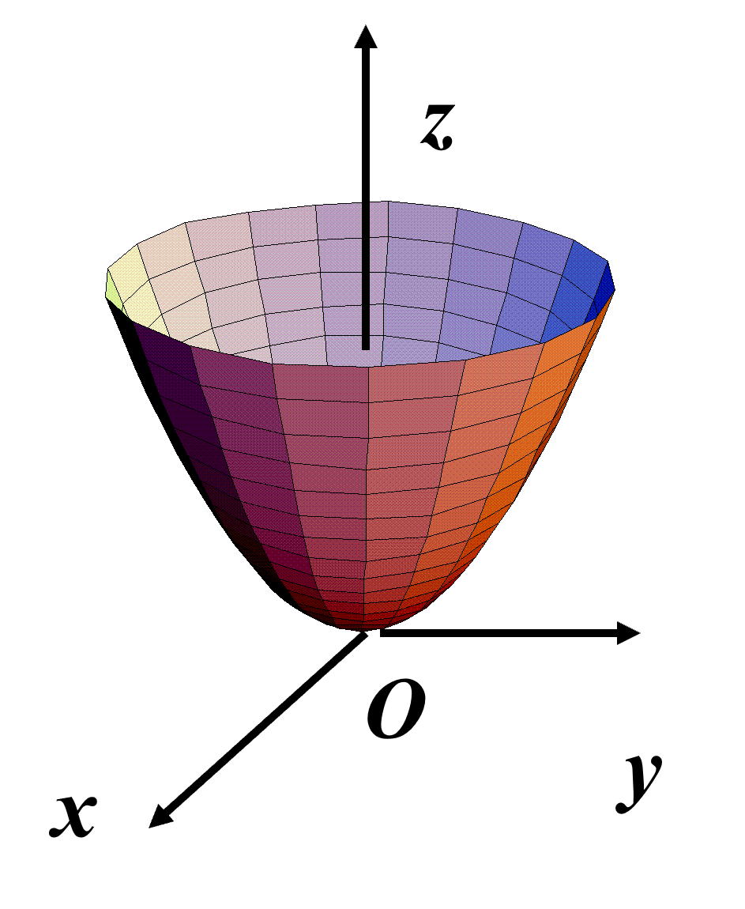

# 高数下习题

[toc]

## 线面积分的计算

> 先判断是否与积分路径有关
>
> * $$
>   \frac{\part P}{\part y}=\frac{\part Q}{\part x}\\
>   I=\oint_LPdx+Qdy=0
>   $$
>
> * $$
>   \frac{\part P}{\part y}\neq\frac{\part Q}{\part x}\\
>   I=\pm\iint_\limits D(\frac{\part Q}{\part x}-\frac{\part P}{\part y})=0
>   $$
>
> * $$
>   A=\frac12\oint_Lx\ dy-y\ dx
>   $$

1. 计算$\displaystyle \int_L(x^2-2xy)dx+(y^2-2xy)dy$，$L$从点$A(2,-1)$到$B(2,2)$再到$C(0,2)$的折线

   （最基本对曲线积分的算法）

   

   ```python
   from sympy import *
   
   init_printing(use_unicode=True, wrap_line=False)
   
   x, y = symbols('x y')
   
   eq1 = y**2 - 2 * x * y
   eq2 = x**2 - 2 * x * y
   
   res = integrate(eq1, (y, -1, 2)).subs(x, 2) + integrate(eq2, (x, 2, 0)).subs(y, 2)
   pprint(res.simplify())
   
   # 7/3
   ```

2. 计算$\displaystyle I=\int_L(x^2+2xy)dx+(x^2+y^4)dy$，其中$L$为由点$O(0,0)$到点$A(1,1)$的曲线$y=\sin\dfrac{\pi}{2}x$

   （与积分路径无关的条件使用）

   

   ```python
   from sympy import *
   
   init_printing(use_unicode=True, wrap_line=False)
   
   x, y = symbols('x y')
   
   eq1 = x**2 + 2 * x * y
   eq2 = x**2 + y**4
   
   pprint(diff(eq1, y))
   print()
   pprint(diff(eq2, x))
   print()
   
   res = integrate(eq1, (x, 0, 1)).subs(y, 0) + integrate(eq2, (y, 0, 1)).subs(x, 1)
   
   pprint(res)
   
   # 2⋅x
   
   # 2⋅x
   
   # 23
   # ──
   # 15
   ```

3. 计算$\displaystyle I=\int_L(e^x\sin y-my)dx+(e^x\cos y-m)dy$，其中$L$为由点$(a,0)$到点$(0,0)$的上半圆周$x^2+y^2=ax$，$y\ge0$

   （格林公式的应用）

   ```python
   from sympy import *
   
   init_printing(use_unicode=True, wrap_line=False)
   
   x, y, m, a = symbols('x y m a')
   
   eq1 = E**x * sin(y) - m * y
   eq2 = E**x * cos(y) - m
   
   pprint(diff(eq1, y).simplify())
   print()
   pprint(diff(eq2, x))
   print()
   
   eq3 = eq2.diff(x) - eq1.diff(y)
   pprint(eq3)
   print()
   
   res = eq3 * (a / 2)**2 * pi / 2
   pprint(res)
   
   #       x
   # -m + ℯ ⋅cos(y)
   
   #  x
   # ℯ ⋅cos(y)
   
   # m
   
   #    2
   # π⋅a ⋅m
   # ────
   #   8
   ```

4. 设平面力场的大小等于作用点到原点的距离，方向为作用点的向径方向按逆时针旋转$90\degree$，试求质点沿曲线$(x-2)^2+(y-3)^2=2$，从点$A(1,2)$按逆时针移动到点$B(3,4)$时场力所作的功

   （格林公式的应用）

   
   $$
   \vec F=(-y,x)\\
   W=\oint_{AB}\vec F\cdot d\vec S-\int_{\vec{BA}}\vec F\cdot(dx,dy)
   $$

   ```python
   from sympy import *
   
   init_printing(use_unicode=True, wrap_line=False)
   
   x,y=symbols('x y')
   
   res=2*sqrt(2)**2*pi/2+integrate(-(x+1)+x,(x,1,5))
   
   pprint(res)
   
   # -4 + 2⋅π
   ```

   $$
   A=\frac12\oint_Lx\ dy-y\ dx
   $$

5. 求力$\vec F=(y,z,x)$沿有向闭曲线$\Gamma$所作的功，其中$\Gamma$为平面$x+y+z=1$被三个坐标面所截成三角形的整个边界，从$z$轴正向看去沿顺时针（注意逆时针为正方向）方向

   （斯托克斯公式的应用）

   

   三角形区域设为：$\Sigma$，方向向量$\vec n=\dfrac{1}{\sqrt3}(1,1,1)$
   $$
       \begin{align*}
       W&=\oint_\Gamma ydx+zdy+xdz\\
       &=-\iint_\Sigma
       \begin{vmatrix}
       \frac1{\sqrt3}&\frac1{\sqrt3}&\frac1{\sqrt3}\\
       \frac{\part}{\part x}&\frac{\part}{\part y}&\frac{\part}{\part z}\\
       y&z&x
       \end{vmatrix}
       \ dS\\
       &=-\frac1{\sqrt3}\iint_\Sigma(-3)\ dS\\
       &=\sqrt3\iint_{Dxy}dxdy=\frac32
       \end{align*}
   $$

6. 计算$\displaystyle \oint_\Gamma y^2dx+z^2dy+x^2dz$,其中$\Gamma$是球面$x^2+y^2+z^2=R^2$和柱面$x^2+y^2=Rx$的交线$(z\ge0)$，从$z$轴正向看为逆时针方向

   （换元法的应用）

   

   令$x=\frac R2+\frac R2\cos t$，$y=\frac R2\sin t$，$(0\le t\le2\pi)$

   代入球面方程可得：$z=R\sin\dfrac t2$

   ```python
   from sympy import *
   
   init_printing(use_unicode=True, wrap_line=False)
   
   t, R = symbols('t R')
   
   x = R / 2 + R / 2 * cos(t)
   y = R / 2 * sin(t)
   z = R * sin(t / 2)
   
   eq = y**2 * x.diff(t) + z**2 * y.diff(t) + x**2 * z.diff(t)
   res = integrate(eq, (t, 0, 2 * pi))
   
   pprint(res.simplify())
   
   #     3
   # -π⋅R
   # ─────
   #   4
   ```

7. 设有一物质曲面$\Sigma$是由$z=\sqrt{x^2+y^2}$及$z=1$所围立体的边界曲面，曲面的面密度函数为$f(x,y,z)=x^2+y^2$，求该曲面的质量$M$

   （第一类曲面积分的算法）

   

   ```python
   from sympy import *
   
   init_printing(use_unicode=True, wrap_line=False)
   
   x, y, R, theta = symbols('x y R theta')
   
   f = x**2 + y**2
   z1 = sqrt(f)
   z2 = Symbol('1')
   
   eq1 = f * sqrt(1 + z1.diff(x)**2 + z1.diff(y)**2)
   eq2 = f * sqrt(1 + z2.diff(x)**2 + z2.diff(y)**2)
   
   eq3 = eq1 + eq2
   eq3 = eq3.subs(x, R * cos(theta)).subs(y, R * sin(theta)) * Matrix(
       [R * cos(theta), R * sin(theta)]).jacobian(Matrix([theta, R])).det()
   res = integrate(eq3, (theta, 0, 2 * pi), (R, 0, 1))
   
   pprint(res.simplify())
   
   # π⋅(-√2 - 1)
   # ───────
   #      2
   ```

8. 计算$\displaystyle I=\iint_\Sigma[f(x,y,z)+x]\ dydz+[2f(x,y,z)+y]dzdx+[f(x,y,z)+z]dxdy$，$f(x,y,z)$为连续函数，$\Sigma$为平面$x-y+z=1$在第四象限部分的上侧

   （归一法求解）

   

   $\because\Sigma$的法向量：$\vec n=(1,-1,1)$

   $\therefore\cos\alpha=\frac1{\sqrt3},\cos\beta=-\frac1{\sqrt3},\cos\gamma=\frac1{\sqrt3}$
   $$
   I=\iint_\Sigma(\ P\frac{\cos\alpha}{\cos\gamma}+Q\frac{\cos\beta}{\cos\gamma}+R\ )\ dxdy
   $$

   ```python
   from sympy import *
   
   init_printing(use_unicode=True, wrap_line=False)
   
   x, y = symbols('x y')
   f = Function('f')
   
   z = 1 - x + y
   
   eq1 = f(x, y, z) + x
   eq2 = 2 * f(x, y, z) + y
   eq3 = f(x, y, z) + z
   
   res = integrate(eq1 - eq2 + eq3, (y, -x - 1, 0), (x, 0, 1))
   
   pprint(res)
   
   # 3/2
   ```

9. 计算$\displaystyle I=\iint_\Sigma ydydz-xdzdx+z^2dxdy$，其中$\Sigma$为曲面$z=\sqrt{x^2+y^2}$被平面$z=1,z=2$所截部分的外侧

   （归一法求解）

   

   ```python
   from sympy import *
   
   init_printing(use_unicode=True, wrap_line=False)
   
   x, y, R, theta = symbols('x y R theta')
   z = sqrt(x**2 + y**2)
   
   cos_alpha = z.diff(x) / sqrt(1 + z.diff(x)**2 + z.diff(y)**2)
   cos_beta = z.diff(y) / sqrt(1 + z.diff(x)**2 + z.diff(y)**2)
   cos_gamma = -1 / sqrt(1 + z.diff(x)**2 + z.diff(y)**2)
   
   eq1 = y
   eq2 = -x
   eq3 = z**2
   
   eq4 = eq1 * cos_alpha / cos_gamma + eq2 * cos_beta / cos_gamma + eq3
   
   eq4 = eq4.subs(x, R * cos(theta)).subs(y, R * sin(theta)) * Matrix(
       [R * cos(theta), R * sin(theta)]).jacobian(Matrix([theta, R])).det()
   
   res = integrate(eq4, (theta, 0, 2 * pi), (R, 1, 2))
   
   pprint(res)
   
   # -15⋅π 
   # ───
   #   2
   ```

10. 计算$\displaystyle \iint_\Sigma x^2y^2z\ dxdy$，$\Sigma$：曲面$z=x^2+y^2(z\le1)$下侧

    （高斯公式）

    

    添加曲面$\Sigma'$：$z=1(x^2+y^2\le1)$上侧
    $$
    \begin{align*}
    I&=\iint_{\Sigma+\Sigma'}-\iint_{\Sigma'}\\
    &=\iint_{\Sigma+\Sigma'} x^2y^2z\ dxdy-\iint_{\Sigma'}x^2y^2z\ dxdy\\
    &=\iiint_\Omega x^2y^2\ dV-\iint_Dx^2y^2\ dxdy\\
    \end{align*}
    $$

    ```python
    from sympy import *
    
    init_printing(use_unicode=True, wrap_line=False)
    
    x, y, z = symbols('x y z')
    
    eq = x**2 * y**2
    
    res = Integral(eq, (z, x**2 + y**2, 1), (x, -sqrt(1 - y**2), sqrt(1 - y**2)),
                   (y, -1, 1)) - Integral(eq, (x, -sqrt(1 - y**2), sqrt(1 - y**2)),
                                          (y, -1, 1))
    
    pprint(res)
    print()
    pprint(res.doit().simplify())
    
    #            ________                       ________
    #           /      2                       /      2
    #     1   \/  1 - y                  1   \/  1 - y      1
    #     /        /                     /        /         /
    #    |        |                     |        |         |
    #    |        |       2  2          |        |         |     2  2
    # -  |        |      x *y  dx dy +  |        |         |    x *y  dz dx dy
    #    |        |                     |        |         |
    #   /        /                     /        /         /
    #   -1      ________               -1      ________  2    2
    #          /      2                       /      2  x  + y
    #       -\/  1 - y                     -\/  1 - y
    
    # - π 
    # ----
    #  32
    ```

11. 计算$\displaystyle I=\iint_\Sigma(8y+1)x\ dydz+2(1-y^2)\ dzdx-4yz\ dxdy$，其中$\Sigma$是由曲线$\displaystyle \begin{cases*}z=\sqrt{y-1}\\x=1\end{cases*}(1\le y\le3)$绕$y$轴旋转一周所成的曲面，它的法向量与$y$轴正向的夹角恒大于$\dfrac\pi2$

    （高斯公式）

    

    添加曲面$\Sigma'$：$y=3(x^2+z^2\le2)$的外侧
    $$
    \begin{align*}
    I&=\iint_{\Sigma+\Sigma'}-\iint_\Sigma'\\
    &=\iint_{\Sigma+\Sigma'}[(8y+1)x\ dydz+2(1-y^2)\ dzdx-4yz\ dxdy\ ]-\iint_D2(1-3^2)\ dzdx
    \end{align*}
    $$

    ```python
    from sympy import *
    
    init_printing(use_unicode=False, wrap_line=False)
    
    x, y, z = symbols('x y z')
    
    eq1 = (8 * y + 1) * x
    eq2 = 2 * (1 - y**2)
    eq3 = -4 * y * z
    
    eq_ = eq1.diff(x) + eq2.diff(y) + eq3.diff(z)
    
    res = Integral(eq_, (y, 1 + x**2 + z**2, 3),
                   (x, -sqrt(2 - z**2), sqrt(2 - z**2)),
                   (z, -sqrt(2), sqrt(2))) + 32 * pi
    
    pprint(res)
    print()
    pprint(res.doit().simplify())
    
    #             ________
    #     ___    /      2
    #   \/ 2   \/  2 - z        3
    #     /         /           /
    #    |         |           |
    #    |         |           |      1 dy dx dz + 32·π
    #    |         |           |
    #   /         /           /
    #    ___     ________  2    2
    # -\/ 2     /      2  x  + z  + 1
    #        -\/  2 - z
    
    # 34·π
    ```

## 级数

### 无穷级数

> 性质：
>
> * 收敛$+$收敛$\Longrightarrow$收敛
> * 收敛$+$发散$\Longrightarrow$发散
> * 发散$+$发散$\Longrightarrow$未必发散
> * 收敛级数 加括号后所成的级数仍收敛于原7级数的和，但收敛级数去括号后所成的级数不一定收敛
>
> 收敛级数的必要条件：
>
> 设收敛级数$\displaystyle S=\sum_{n=1}^{\infty}u_n$，则必有$\displaystyle\lim_{n\to\infty}n_n=0$
>
> 柯西审敛原理（用做证明题）：
>
> 级数$\displaystyle \sum_{n=1}^\infty u_n$收敛$\Longleftrightarrow$ $\forall \varepsilon>0$，$\exists N\in N_+$，当$n>N$时，对$\forall p\in N_+$，有$|n_{n+1}+u_{n+2}+\cdots+u_{n+p}|<\varepsilon$
>
> $P$收敛级数：
> $$
> \sum_{n=1}^\infty\frac1{n^P},\quad (P>1)
> $$
> 调和级数 ：
> $$
> \sum_{n=1}^\infty\frac1n
> $$
> **调和级数和$P$收敛级数是两个常用的比较级数**
>
> 正向级数$\displaystyle\sum_{n=1}^\infty u_n$收敛的充要条件是其部分和数列$\{s_n\}$有上界
>
> 比较审敛法：
>
> 设两正向级数$\displaystyle \sum_{n=1}^\infty u_n$，$\displaystyle\sum_{n=1}^\infty v_n$满足$\displaystyle\lim_{n\to\infty}\frac{u_n}{v_n}=l$，则有
>
> * 当$0<l<\infty$时，两个级数同时收敛或发散
> * 当$l=0$时，且$\displaystyle\sum_{n=1}^{\infty}v_n$收敛时，$\displaystyle\sum_{n=1}^\infty u_n$也收敛
> * 当$l=\infty$且$\displaystyle\sum_{n=1}^{\infty}v_n$，发散时，$\displaystyle\sum_{n=1}^{\infty}u_n$也发散
>
> 比值审敛法（`D'alembert`判别法）：
>
> 设$\sum u_n$为正向级数，且$\displaystyle\lim_{n\to\infty}\frac{u_{n+1}}{u_n}=\rho$，则：
>
> * 当$\rho<1$时，级数收敛
> * 当$\rho>1$或$\rho=\infty$时，级数发散
>
> 注意：当$\displaystyle\lim_{n\to\infty}\frac{u_{n+1}}{n}=1$时，级数可能收敛也可能发散
>
> 根值审敛法（`Cauchy`判别法）：
>
> 设$\displaystyle\sum_{n=1}^\infty u_n$为正向级数，且$\displaystyle\lim_{n\to\infty}\sqrt[n]{u_n}=\rho$，则
>
> * 当$\rho<1$时，级数收敛
> * 当$\rho>1$时，级数发散
>
> 注意：当$\rho=1$时，级数可能收敛可能发散
>
> 交错级数及其审敛法（`Leibnitz`判别法）：
>
> 设$u_n>0,\ n=1,2,\cdots$，则各项符号正负相间的级数$u_1-u_2+u_3-\cdots+(-1)^{n-1}u_n+\cdots$称为`交错级数`
>
> 若交错级数满足条件：
>
> * $u_n\ge u_{n+1}\ (n=1,2,\cdots)$
> * $\displaystyle\lim_{n\to\infty}u_n=0$
>
> 则级数$\displaystyle\sum_{n=1}^\infty(-1)^{n-1}u_n$收敛，且其和$S\le u_1$，其余项满足$|r_n|\le u_{n+1}$
>
> 绝对收敛与条件收敛：
>
> * 对任意项级数$\displaystyle\sum_{n=1}^\infty u_n$，若$\displaystyle\sum_{n=1}^\infty |u_n|$收敛，则称原级数 $\displaystyle\sum_{n=1}^\infty u_n$**绝对收敛**
>
> * 对任意项级数$\displaystyle\sum_{n=1}^\infty u_n$，若$\displaystyle\sum_{n=1}^\infty |u_n|$发散，则称原级数 $\displaystyle\sum_{n=1}^\infty u_n$**条件收敛**
>
> *绝对收敛级数一定收敛

1. 求$\displaystyle\sum_{n=1}^{\infty}\frac1{n^3+3n^2+2n}$的值
   $$
   \begin{align*}
   &\frac1{n^3+3n^2+2n}\\
   =&\frac1{n(n+1)(n+2)}\\
   =&\frac12\frac{(n+2)-n}{n(n+1)(n+2)}\\
   =&\frac12\left [\frac1{n(n+1)}-\frac1{(n+1)(n+2)}\right ]
   \end{align*}
   $$

   ```python
   from sympy import *
   
   init_printing(use_unicode=False, wrap_line=False)
   
   n = symbols("n")
   
   eq = 1 / (n**3 + 3 * n**2 + 2 * n)
   
   res = Sum(eq, (n, 1, oo))
   
   pprint(res)
   print()
   pprint(res.doit().simplify())
   
   #   oo
   # ____
   # \   `
   #  \           1
   #   \   ---------------
   #   /    3      2
   #  /    n  + 3*n  + 2*n
   # /___,
   # n = 1
   
   # 1/4
   ```

2. 计算$S_n=\displaystyle\sum_{n=1}^{\infty}\frac{2n-1}{2^n}$
   $$
   \begin{align*}
   &S_n-\frac12S_n\\
   =&\left(\frac12+\frac2{2^2}+\frac{5}{2^3}+\cdots+\frac{2n-1}{2^n}\right)-
   \left(\frac1{2^2}+\frac2{2^3}+\frac{5}{2^4}+\cdots+\frac{2n-1}{2^{n+1}}\right)\\
   =&\frac12+\frac12+\frac1{2^2}+\frac1{2^3}+\cdots+\frac1{2^{n-1}}-\frac{2n-1}{2^{n+1}}
   \end{align*}
   $$

   ```python
   from sympy import *
   
   init_printing(use_unicode=False, wrap_line=False)
   
   n = symbols("n")
   
   eq = (2 * n - 1) / 2**n
   
   res = Sum(eq, (n, 1, oo))
   
   pprint(res.simplify())
   print()
   pprint(res.doit().simplify())
   
   #   oo
   #  ___
   #  \  `
   #   \    -n
   #   /   2  *(2*n - 1)
   #  /__,
   # n = 1
   
   # 3
   ```

3. 利用柯西审敛原理判别级数$\displaystyle \sum_{n=1}^{\infty}\frac1{n^2}$敛散性

   对$\forall p\in N_+$，有：

   $$
   \begin{align*}
    &|u_{n+1}+u_{n+2}+\cdots+u_{n+p}|\\
    =&\frac1{(n+1)^2}+\frac1{(n+2)^2}+\cdots+\frac1{(n+p)^2}\\
    <&(\frac n{n+1}-\frac{n+1}{n+2})+\cdots+(\frac{{n+p-1}}{{n+p}})\\
    =&(\frac1n-\frac1{n+1})+(\frac1{n+1}-\frac1{n+2}+\cdots+(\frac1{(n+p-1)}-\frac1{n+p})\\
    &=\frac1n-\frac1{n+p}<\frac1n
    \end{align*}
   $$

4. 判别级数$\displaystyle\sum_{n=1}^{\infty}\sin\frac1n$的敛散性

   （比较审敛法，调和级数）

   $\because$
   $$
   \lim_{n\to\infty}\frac{\sin\frac1n}{\frac1n}=1，\quad\sum_{n=1}^{\infty}\frac1n发散
   $$
   $\therefore\ \displaystyle\sum_{n=1}^{\infty}\sin\frac1n\ $发散

5. 判别级数$\displaystyle\sum_{n=1}^{\infty}\ln(1+\frac1{n^2})$的敛散性

   （比较审敛法，$P$收敛级数）

   $\because$
   $$
   \lim_{n\to\infty}\frac{\ln(1+\frac1{n^2})}{\frac1{n^2}}=1,\quad\sum_{n=1}^{\infty}\frac1{n^2}收敛
   $$
   $\therefore\displaystyle\sum_{n=1}^{\infty}\ln(1+\frac1{n^2})$收敛

6. 判别级数$\displaystyle\sum_{n=1}^{\infty}\frac1{3^n-n}$的敛散性

   （比较收敛法，等比级数）

   $\because$
   $$
   \lim_{n\to\infty}\frac{\frac1{3^n-n}}{\frac1{3^n}}=\lim_{n\to\infty}\frac1{1-\frac n{3^n}}=1,\quad\sum_{n=1}^\infty\frac1{3^n}收敛
   $$
   $\therefore\displaystyle\frac1{3^n-n}$收敛

7. 判别$\displaystyle\sum_{n=1}^\infty\frac{3n-2}{n^3-2n^2+n}$收敛性

   $\because$
   $$
   \lim_{n\to\infty}\frac{\frac{3n-2}{n^3-2n^2+n}}{\frac1{n^2}}=3,\quad\sum_{n=1}^\infty\frac1{n^2}收敛
   $$
   $\therefore\displaystyle\sum_{n=1}^\infty\frac{3n-2}{n^3-2n^2+n}$收敛

8. 判别$\displaystyle\sum_{n=1}^\infty\frac1{n!}$的收敛性

   $\because$
   $$
   \frac{u_{n+1}}{u_n}=\frac{\frac1{(n+1)!}}{\frac1{n!}}=\frac1{n+1}<1
   $$
   $\displaystyle\therefore\sum_{n=1}^\infty\frac1{n!}$收敛

9. 判断$\displaystyle\sum_{n=1}^\infty\frac{n!}{10^n}$的收敛性

   $\because$
   $$
   \frac{u_{n+1}}{u_n}=\frac{(n+1)}{10}\to\infty\quad(n\to\infty)
   $$
   $\displaystyle\therefore\sum_{n=1}^\infty\frac{n!}{10^n}$发散

10. 判断$\displaystyle\sum_{n=1}^\infty(\sqrt[n]2-1)^n$的收敛性

    $\because$
    $$
    \sqrt[n]{u_n}=\sqrt[n]2-1\to0
    $$
    $\therefore\displaystyle\sum_{n=1}^\infty(\sqrt[n]2-1)^n$收敛

11. 判断$\displaystyle\sum_{n=1}^\infty(\frac n{n+1})^{n^2}$的收敛性

    $\because$
    $$
    \sqrt[n]{u_n}=(\frac n{n+1})^n=\frac1{(1+\frac1n)^n}\to\frac1e
    $$
    $\displaystyle\therefore\sum_{n=1}^\infty(\frac n{n+1})^{n^2}$收敛

12. 判断$\displaystyle\sum_{n=1}^\infty\frac{a^n}{\ln(n+1)},\ (a>0)$的收敛性

    $\because$
    $$
    \sqrt[n]{u_n}=\frac a{\sqrt[n]{\ln(n+1)}}\\
    1<\sqrt[n]{\ln(n+1)}<\sqrt[n]n\quad(n>2)\\
    \Longrightarrow\sqrt[n]{u_n}\to a
    $$
    $\displaystyle\therefore\sum_{n=1}^\infty\frac{a^n}{\ln(n+1)},\ (a<1)$时，级数收敛；$\displaystyle\sum_{n=1}^\infty\frac{a^n}{\ln(n+1)}=\frac1{\ln(n+1)}>\frac1n,\ (a=1)$级数发散

13. 判别$\displaystyle\sum_{n=2}^\infty\frac{(-1)^n\sqrt n}{n-1}$的收敛性

    $\because$
    $$
    \left(\frac{\sqrt x}{x-1}\right)'=\frac{-(1+x)}{2\sqrt x(x-1)^2}<0
    $$
    函数$\dfrac{\sqrt x}{x-1}$单调递减

    又$\because$
    $$
    \lim_{n\to\infty}u_n=\lim_{n\to\infty}\frac{\sqrt n}{n-1}=0
    $$
    $\displaystyle\therefore\sum_{n=2}^\infty\frac{(-1)^n\sqrt n}{n-1}$收敛

### 幂级数

> 对**函数项级数**$\displaystyle\sum_{n=1}^\infty u_n(x)$，对$x_0\in I$，若常数项级数$\displaystyle\sum_{n=1}^\infty u_n(x_0)$收敛，称$x_0$为其**收敛点**，所有收敛点的全体称为**收敛域**；若常数项级数$\displaystyle\sum_{n=1}^\infty u_n(x_0)$发散，称$x_0$为其**发散点**，所有收敛点的全体称为**发散域**
>
> 在收敛域上，函数项的级数和是$x$的函数$S(x)$，称为级数的**和函数**，并记作$\displaystyle S(x)=\sum_{n=1}^\infty u_n(x)$
>
> 注意：函数项级数在某点$x$的收敛问题，实质上是数项级数的收敛问题
>
> 定理一（`Abel`定理）：
>
> 若幂级数$\displaystyle\sum_{n=0}^\infty a_nx^n$在$x=x_0$处收敛，则满足$|x|<|x_0|$的一切$x$幂级数都绝对收敛
>
> 定理二：
>
> 若$\displaystyle\sum_{n=0}^\infty a_nx^n$的系数满足$\displaystyle\lim_{n\to\infty}|\frac{a_{n+1}}{a_n}|=\rho$，则
>
> * 当$\rho\ne0$时，$R=\dfrac1\rho$
> * 当$\rho=0$时，$R=+\infty$
> * 当$\rho=+\infty$时，$R=0$
>
> （$R$为收敛半径）
> $$
> (\sum_{n=0}^\infty a_nx^n)\cdot(\sum_{n=0}^\infty b_nx^n)=\sum_{n=0}^\infty c_nx^n\\
> c_n=a_0\cdot b_n+a_1\cdot b_{n-1}+\cdots+a_n\cdot b_0\quad(柯西乘积)
> $$
>
> 幂级数$\displaystyle\sum_{n=0}^\infty a_nx^n$的和函数$S(x)$在其收敛域$I$上可积，并有逐项积分公式：
> $$
> \int_0^xS(x)\ dx=\int_0^x\left[\sum_{n=0}^\infty a_nx^n\right]\ dx=\sum_{n=0}^\infty\int_0^x a_nx^n\ dx=\sum_{n=0}^\infty\frac{a_n}{n+1}x^{n+1},\quad(x\in I)
> $$
> 

1. 求级数$\displaystyle\sum_{n=1}^\infty\frac{(-1)^n}n(\frac1{1+x})^n$的收敛域
   $$
   \frac{|u_{n+1}(x)|}{|u_n(x)|}=\frac n{n+1}\frac1{|1+x|}\to\frac1{|1+x|}
   $$
   若$\dfrac1{|1+x|}<1$，即$x>0\or x<-2$时，原级数绝对收敛

   若$\dfrac1{|1+x|}=1$，即$x=0\or x=-2$时

   * 当$x=0$时，级数$\displaystyle\sum_{n=1}^\infty\frac{(-1)^n}n$收敛
   * 当$x=-2$时，级数$\displaystyle\sum_{n=1}^\infty\frac1n$发散

   $\therefore$级数的收敛域为$(-\infty,-2)\cup[0,+\infty)$

2. 求幂级数$\displaystyle x-\frac{x^2}2+\frac{x^3}3-\cdots+(-1)^{n-1}\frac{x^n}n+\cdots$的收敛半径和收敛域
   $$
   R=\lim_{n\to\infty}|\frac{a_n}{a_{n+1}}|=\lim_{n\to\infty}\frac{n+1}n=1
   $$
   对端点$x=1$，级数为交错级数$\displaystyle\sum_{n=1}^\infty(-1)^{n-1}\frac1n$，收敛

   对端点$x=-1$，级数为$\displaystyle\sum_{n=1}^\infty\frac{-1}n$，发散

   $\therefore$收敛域为$(-1,1]$

3. 求$\displaystyle\sum_{n=0}^\infty n!x^n$的收敛域
   $$
   R=\lim_{n\to\infty}\frac{a_n}{a_{n+1}}=\lim_{n\to\infty}(n+1)=+\infty
   $$
   $\therefore$收敛域为$(-\infty,+\infty)$

4. 求幂级数$\displaystyle\sum_{n=1}^\infty\frac{(2n)!}{(n!)^2}x^{2n}$的收敛半径
   $$
   \lim_{n\to\infty}\left|\frac{u_{n+1}(x)}{u_n(x)}\right|=\lim_{n\to\infty}\frac{(2n+1)(2n+2)}{(n+1)^2}x^2=4x^2
   $$
   当$4x^2<1$时，即$|x|<\dfrac12$时级数收敛

   当$4x^2>1$时，即$|x|>\dfrac12$时级数发散

   $\therefore$收敛半径为$R=\dfrac12$

5. 求幂级数$\displaystyle\sum_{n=1}^\infty nx^n$的和函数$S(x)$
   $$
   R=\lim_{n\to\infty}\left|\frac{nx^n}{(n+1)x^{n+1}}\right|=\frac n{n+1}=1
   $$
   收敛域为$(-1,1)$
   $$
   S(x)=\sum_{n=1}^\infty nx^n=x\sum_{n=1}^\infty nx^{n-1}=x\sum_{n=1}^\infty(x^n)'=x(\sum_{n=1}^\infty x^n)'\\
   =x\left(\frac x{1-x}\right)'=\frac x{(1-x)^2}
   $$

6. 求级数$\displaystyle\sum_{n=1}^\infty(-1)^{n-1}\frac{x^n}n$的和函数
   $$
   R=\lim_{n\to\infty}\left|\frac{u_{n+1}}{u_n}\right|=1
   $$
   $\therefore$收敛域为$(-1,1]$
   $$
   s'(x)=1-x+x^2-\cdots=\frac1{1+x},\quad(-1<x<1)
   $$
   $\therefore s(x)=\ln(1+x)$

7. 求级数$\displaystyle\sum_{n=2}^\infty\frac1{(n^2-1)2^n}$的和

   设$\displaystyle S(x)=\sum_{n=2}^\infty\frac{x^n}{n^2-1},\quad x\in(-1,1)$，则
   $$
   \begin{align*}
   S(x)&=\sum_{n=2}^\infty\frac12\left(\frac1{n-1}-\frac1{n+1}\right)x^n\\
   &=\frac x2\sum_{n=2}^\infty\frac{x^{n-1}}{n-1}-\frac1{2x}\sum_{n=2}^\infty\frac{x^{n+1}}{n+1}\quad(x\ne0)\\
   &=\frac x2\sum_{n=1}^\infty\frac{x^n}n-\frac1{2x}\sum_{n=3}^\infty\frac{x^n}n\\
   &=\left(\frac x2-\frac1{2x}\right)\sum_{n=1}^\infty\frac{x^n}n+\frac1{2x}(x+\frac{x^2}2)\\
   &=\frac{1-x^2}{2x}\ln(1-x)+\frac{2+x}4
   \end{align*}
   $$
   $\displaystyle\therefore S(\frac12)=\sum_{n=2}^\infty\frac1{(n^2-1)2^n}=\frac58-\frac34\ln2$

### 泰勒（`Taylor`）级数

> 若函数$f(x)$在$x_0$的某领域内具有任意阶导数，则称$\displaystyle\sum_{n=0}^\infty\frac{f^{(n)}(x_0)}{n!}(x-x_0)^n$为$f(x)$的**泰勒级数**，当$x_0=0$时，又称**麦克劳林级数** 
>
> 直接展开法：
>
> * 第一步求函数及其各阶导数在$x=0$处的值
>
> * 第二步写出麦克劳林级数，并求出其收敛半径$R$
>
> * 第三步判别在收敛区间$(-R,R)$内$\displaystyle\lim_{n\to\infty}R(x)$是否为$0$或$|f^{(n)}(x)|\le M$
>
> 间接展开法：
>
> 根据唯一性，利用常见展开式，通过变量代换，四则运算，恒等变形，逐项求导，逐项积分等方法，求展开式

1. 将函数$\dfrac1{1+x^2}$展开成$x$的幂级数

   $\because$
   $$
   \frac1{x+1}=1-x+x^2-\cdots+(-1)^nx^n+\cdots\quad(-1<x<1)
   $$
   $\therefore$
   $$
   \frac1{1+x^2}=1-x^2+x^4+\cdots+(-1)^nx^{2n}+\cdots\quad(-1<x<1)
   $$

2. 将函数$\arctan x$展开成$x$的幂级数

   $\because$
   $$
   (\arctan x)'=\frac1{1+x^2}=1-x^2+x^4-x^6+\cdots+(-1)^nx^{2n}+\cdots\quad x\in(-1,1)
   $$
   $\therefore$
   $$
   \arctan x=\int_0^x\frac{dx}{1+x^2}=x-\frac13x^3+\frac15x^5-\cdots+(-1)^n\frac{x^{2n+1}}{2n+1}+\cdots\quad x\in[-1,1]
   $$

3. 将$\displaystyle\frac1{x^2+4x+3}$展开成$x-1$的幂级数
   $$
   \begin{align*}
   &\frac1{x^2+4x+3}\\
   =&\frac1{(x+1)(x+3)}\\
   =&\frac1{2(1+x)}-\frac1{2(3+x)}\\
   =&\frac1{4(1+\frac{x-1}2)}-\frac1{8(1+\frac{x-1}4)}\\
   =&\sum_{n=0}^\infty(-1)^n(\frac1{2^{n+2}}-\frac1{2^{2n+3}})(x-1)^n\\
   &(-1<x<3)
   \end{align*}
   $$

4. 将函数$\displaystyle f(x)=\sqrt{x^5+4x^4}$展开成$x$的幂级数
   $$
   f(x)=2x^2(1+\frac x4)^\frac12
   $$
   $\because$
   $$
   \sqrt{1+x}=1+\frac12x-\frac1{2\cdot4}x^2+(-1)^{n+1}\frac{(2n-3)!!}{(2n)!!}x^n+\cdots\quad x\in[-1,1]
   $$
   $\therefore$
   $$
   \begin{align*}
   f(x)&=2x^2(1+\frac x4)^\frac12\\
   &=2x^2\left[1+\frac12\cdot\frac x4+\cdots+\sum_{n=2}^\infty(-1)^{n+1}\frac{(2n-3)!!}{(2n)!!}\left(\frac x4\right)^n\right]\\
   &=2x^2+\frac14x^3+2\sum_{n=2}^\infty(-1)^{n+1}\frac{(2n-3)!!}{4\cdot(2n)!!}x^{n+2}\quad x\in[-4,4]
   \end{align*}
   $$

### 傅里叶级数

> 三角级数：
> $$
> \frac{a_0}2+\sum_{k=1}^\infty(a_n\cos nx+b_n\sin nx)
> $$
> 正交：
>
> 任意两个不同函数之积在$[-\pi,\pi]$上的积分等于0
> $$
> \begin{align*}
> &\int_{-\pi}^\pi\cos kx\cos nx\ dx=0&(k\ne n)\\
> &\int_{-\pi}^\pi\sin kx\sin nx\ dx=0&(k\ne n)\\
> &\int_{-\pi}^\pi\cos kx\sin nx\ dx=0
> \end{align*}
> $$
